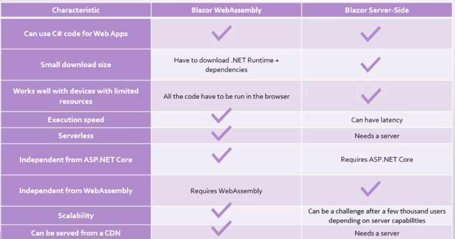
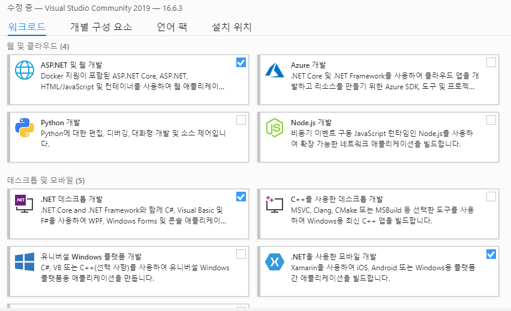
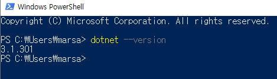

# Programming in Blazor - ASP.NET Core 3.2 

---

## 1.Intro

---

### Advantages of using blazor

- .NET Ecosystem
- C# (LINQ, asynchronous programming)
- Working with components

```
the client side model(blazor WebAssembly) 
```

### Blazor WebAssembly

- WebAssembly to execute .NET apps in web browser

  -Highly scalable(adv) 

  -Downloading .NET runtime +  DLLs (dis-adv)

- Blazor (client side)

- Blazor (client side + ASP.NET Core)



> 웹어셈블리랑 서버 비교

https://dotnet.microsoft.com/apps/aspnet/web-apps/blazor



```
실행-> powershell -> dotnet --version 
```



> 파워셀에서 dotnet 확인.

---

## 2. Razor

---

- cshtml속 @을 통해 사용할 수 있음

Pages -> Index.razor

```
@page "/"
<p>Hello, @name.ToUpper()</p>
<p>hi, @CustomToUpper(name)</p>
<p>let's add 2+2 = @(2+2)</p>
<button @onclick="@(() => Console.WriteLine("I've been clicked"))">push me</button>
<button @onclick="@WriteInLog">push me</button>

<h1>Hello, world!</h1>

Welcome to your new app.

<SurveyPrompt Title="How is Blazor working for you?" />

@code{
    string name = "Marsa";
    string CustomToUpper(string value) => value.ToUpper();

    void WriteInLog()
    {
        Console.WriteLine("I've been CLICKED!!!");
    }
}
```

- code 부분에 c#코드 넣을 수 있고 page부분에 html 문법 사용가능
- @을 통해 code에서 정의한 것 사용


### Class

- Local class는 같은 파일안 @code부분에 클래스 선언해서 사용하는것.(스코프가 해당 파일에만 적용되므로 한정적으로 사용됨)
- 다른 클래스 모음파일 만들어서 using을 통해 불러 올 수 있음. (using + namespace)

- _imports.razor :  can define using a statements that will be applied to every Razor file in the client project.

### Loop

- for , foreach 사용가능 code 부분에서 선언해주고 불러올 수 있음.

```csharp
    @foreach (var movie in Movies)
    {
        <p>Title : @((MarkupString)movie.Title)</p>
        <p>Release Date : <b>@movie.Releasedate.ToString("dd MMM yyy")</b></p>
    }
    <hr />
    @for (var i = 0; i < Movies.Count; i++)
    {
        <p>Title : <b>@Movies[i].Title</b></p>
        <p>Release Date : <b>@Movies[i].Releasedate.ToString("dd MMM yyy")</b></p>
    }
```

### Async

- 지연을 줄 수 있음

```csharp
 List<Movie> movies;
    protected async override Task OnInitializedAsync()
    {
        await Task.Delay(3000);
        movies = new List<Movie>()
        {
            new Movie(){Title = "Spider-man : Far From Home", Releasedate = new DateTime(2019,7,2)},
            new Movie(){Title = "Moana", Releasedate = new DateTime(2016, 11, 23)},
            new Movie(){Title = "Inception", Releasedate = new DateTime(2010, 7, 16)}
        };
    }
```

## 3.Components

- shared folder에 razor file생성하고 그 안에 선언한 내용을 다른 파일에서 불러 올 수 있음 <MoviesList/>

> Shared => MoviesList.razor

```csharp
@if (movies == null)
{
    <text>loading...</text>
}
else if(movies.Count == 0)
{
    <text>There are no records to show</text>
}
else
{
    @foreach (var movie in movies)
    {
        <p>Title : @((MarkupString)movie.Title)</p>
        <p>Release Date : <b>@movie.Releasedate.ToString("dd MMM yyy")</b></p>
    }
    <hr />
    @for (var i = 0; i < movies.Count; i++)
    {
        <p>Title : <b>@movies[i].Title</b></p>
        <p>Release Date : <b>@movies[i].Releasedate.ToString("dd MMM yyy")</b></p>
    }
}

@code {
    List<Movie> movies;
    protected  override void OnInitialized()
    {
        movies = new List<Movie>()
        {
            new Movie(){Title = "Spider-man : Far From Home", Releasedate = new DateTime(2019,7,2)},
            new Movie(){Title = "Moana", Releasedate = new DateTime(2016, 11, 23)},
            new Movie(){Title = "Inception", Releasedate = new DateTime(2010, 7, 16)}
        };
    }
}

```

### Parameter

- [parameter] code에 넣어서 

```csharp
[Parameter] public List<Movie> Movies { get; set; }
```

shared에서 선언된거 가져올 수 있음

```csharp
    @foreach (var movie in Movies)
    {
        <IndividualMovie Movie="movie" />
    }
```

foreach를 돌릴때 안에 하드코딩 하지 않아도 됨. 다른 곳의 attribute parameter 불러와서 사용 가능.

### Event

- checkbox

```csharp
<input type="checkbox" @onchange="@(() => displayButtons = !displayButtons )"/>

<IndividualMovie Movie="movie" DisplayButtons="displayButtons"/>
```

> displayButtons랑 연결해서 체크 됐을때 안보일때 설정 가능 

### Bind

```csharp
<p>Current count: @currentCount</p>
<button class="btn btn-primary" @onclick="IncrementCount">Click me</button>
<input type="number" @bind="currentCount"/> 
```

> binding해서 같이 변화하게 할 수 있음.

---

### Lifecycle of a Component

- Oninitialized | OninintializedAsync
- OnParametersSet | OnParametersSetAsync
- OnAfterRender | OnAfterRenderAsync
- Rendering

```csharp
@code {
    [Parameter] public List<Movie> Movies { get; set; }

    bool displayButtons = true;

    private void DeleteMovie(Movie movie)
    {
        Movies.Remove(movie);
    }

    protected override void OnInitialized()
    {
        Console.WriteLine("OnInitialized. Movies.Conut = " + Movies.Count.ToString());
    }
    protected override void OnParametersSet()
    {
        Console.WriteLine("OnParametersSet. Movies.Conut = " + Movies.Count.ToString());
    }
    protected override void OnAfterRender(bool firstRender)
    {
        Console.WriteLine("OnAfterRender FirstRender = " + firstRender.ToString());
    }
    protected override bool ShouldRender()
    {
        return true;
    }
}

```


